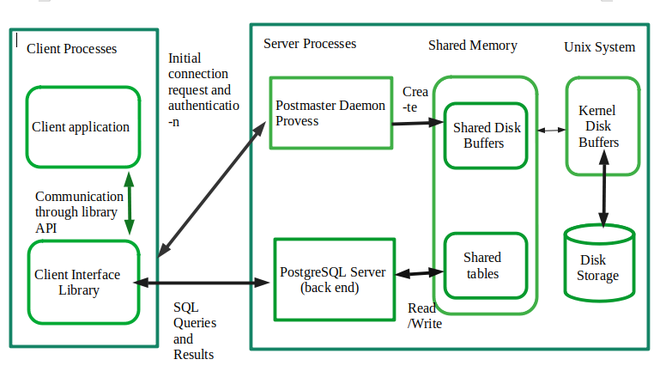

# A. Architectural Fundamentals
1. PostgreSQL uses user and client model. The whole model can be explained with the graph below
   
- Client Process: 
  - Client application: The interface that allows user control / send database command. I.e. Pgadmin, windows shell
  - Client Interface Library: Transfer the commands from application to SQL commands
- Sever Prcess:
  - 
2. Internet connection via TCP/IP
3. PostgreSQL can handel multiple connections from clients which start ("forks") in server. The details of "folk" can be explained by C language
